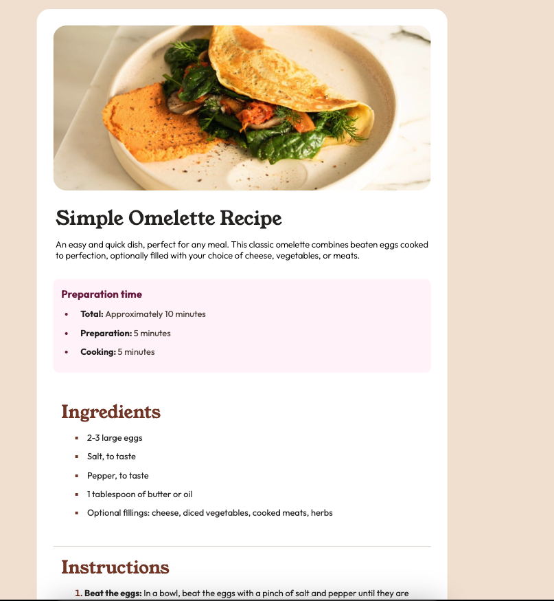

# Recipe Page

A beautiful and responsive recipe web page that showcases various delicious recipes with their ingredients and cooking instructions. Perfect for food enthusiasts who love to explore and try new recipes!

## Table of Contents
- [Demo](#demo)
- [Features](#features)
- [Technologies Used](#technologies-used)
- [Installation](#installation)
- [Usage](#usage)
- [Screenshot](#screenshot)
- [Contributing](#contributing)
- [License](#license)
- [Contact](#contact)

## Demo

Check out the live demo: [Recipe Page Demo](#) *(Replace `#` with the actual link if available)*

## Features

- Beautifully designed recipe cards with images, ingredients, and instructions.
- Responsive layout suitable for both desktop and mobile devices.
- Easy navigation through different recipes.
- User-friendly interface for a seamless browsing experience.

## Technologies Used

- **HTML5**: For structuring the content of the web page.
- **CSS3**: For styling and responsive design.

## Installation

1. Clone the repository:

    ```bash
    git clone https://github.com/bkrcokan13/Recipe-Page.git
    cd Recipe-Page
    ```

2. Open `index.html` in your browser. (You can use extensions like **Live Server** for Visual Studio Code to launch a local development server for easier testing and development.)

## Usage

1. Open the web page in your browser.
2. Browse through the list of recipes.
3. Click on any recipe card to view the full recipe with ingredients and instructions.

## Screenshot

Here is a screenshot of the Recipe Page:

 *(Make sure to add a screenshot image to your repo and update the path accordingly)*

## Contributing

Contributions are welcome! Here’s how you can contribute:

1. Fork the repository.
2. Create a new branch:

    ```bash
    git checkout -b feature/your-feature-name
    ```

3. Commit your changes:

    ```bash
    git commit -m "Add your message here"
    ```

4. Push to the branch:

    ```bash
    git push origin feature/your-feature-name
    ```

5. Open a pull request.

## License

This project is licensed under the MIT License - see the [LICENSE](LICENSE) file for details.

## Contact

Created by [Okan Bakırcı](https://github.com/bkrcokan13) - feel free to contact me!
